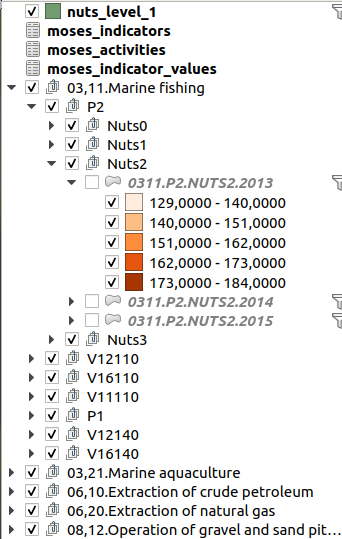
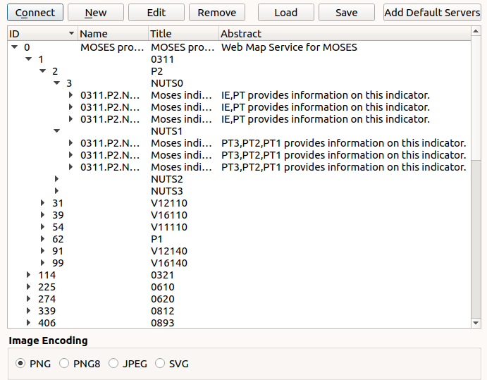

# MOSES data publication as OGC services

This application analyze Moses data provided in PostGIS and build the corresponding QGIS project and Mapserver mapfile.

QGIS project contains group for each activity, indicator and NUTS level and one layer per year:



Same in the view service capabilities:




## Datasets

* NUTS with 3 different levels
* Indicator data


## Indicator conversion


## DB model

List of tables:

* nuts
* moses_status
* moses_activities
* moses_indicators
* moses_indicator_values

List of views:

* nuts_level_1
* nuts_level_2
* nuts_level_3

## DB data loading

Load data using OGR:

### On Windows

``` 

cd C:\OSGeo4W64\bin\


set DATADIR=/data/project/2019/ifremer/moses/20190520
set DBNAME=moses
set DBUSER=www-data
set DBPASSWORD=www-data
set DBSERVER=localhost
set DBPORT=5432
set SHPENCODING=LATIN1


SET PGCLIENTENCODING=%SHPENCODING%
chcp 65001
ogr2ogr.exe -f PostgreSQL ^
 PG:"host=vpostgres2val.ifremer.fr port=5432 user=moses_usr password='The ...' dbname=moses schemas=public,postgis active_schema=postgis" ^
 -lco GEOM_TYPE=geometry ^
 -lco OVERWRITE=YES ^
 -lco SCHEMA=moses ^
 -overwrite ^
 -nlt MULTIPOLYGON ^
 -nln nuts ^
 X:\data_QGIS\MOSES\data\WP4\NUTS\NUTS.shp

ogr2ogr.exe -f PostgreSQL ^
 PG:"host=vpostgres2val.ifremer.fr port=5432 user=moses_usr password='The ...' dbname=moses schemas=public,postgis active_schema=postgis" ^
 -lco SCHEMA=moses ^
 -nln moses_activities_tmp -overwrite ^
 -lco OVERWRITE=YES ^
 X:\data_QGIS\MOSES\data\WP4\moses_NACES.csv

ogr2ogr.exe -f PostgreSQL ^
 PG:"host=vpostgres2val.ifremer.fr port=5432 user=moses_usr password='The ...' dbname=moses schemas=public,postgis active_schema=postgis" ^
 -lco SCHEMA=moses ^
 -nln moses_indicators_tmp -overwrite ^
 -lco OVERWRITE=YES ^
 X:\data_QGIS\MOSES\data\WP4\moses_indicator.csv

ogr2ogr.exe -f PostgreSQL ^
 PG:"host=vpostgres2val.ifremer.fr port=5432 user=moses_usr password='The ...' dbname=moses schemas=public,postgis active_schema=postgis" ^
 -lco SCHEMA=moses ^
 -nln moses_status_tmp -overwrite ^
 -lco OVERWRITE=YES ^
 X:\data_QGIS\MOSES\data\WP4\moses_status.csv

ogr2ogr.exe -f PostgreSQL ^
 PG:"host=vpostgres2val.ifremer.fr port=5432 user=moses_usr password='The ...' dbname=moses schemas=public,postgis active_schema=postgis" ^
 -lco SCHEMA=moses ^
 -nln moses_values_tmp -overwrite ^
 -lco OVERWRITE=YES ^
 X:\data_QGIS\MOSES\data\WP4\moses_values.csv


```
### On linux

```
DATADIR=/data/project/2019/ifremer/moses/20190520
DBNAME=moses
DBUSER=www-data
DBPASSWORD=www-data
DBSERVER=localhost
DBPORT=5432
SHPENCODING=LATIN1

cd $DATADIR
PGCLIENTENCODING=$SHPENCODING ogr2ogr -f PostgreSQL \
 PG:"host=$DBSERVER port=$DBPORT user=$DBUSER password=$DBPASSWORD dbname=$DBNAME" \
 -lco GEOM_TYPE=geometry \
 -lco OVERWRITE=YES \
 -overwrite \
 -nlt MULTIPOLYGON \
 -nln nuts \
 NUTS.shp

PGCLIENTENCODING=$SHPENCODING ogr2ogr -f PostgreSQL \
 PG:"host=$DBSERVER port=$DBPORT user=$DBUSER password=$DBPASSWORD dbname=$DBNAME" \
 -nln moses_activities_tmp -overwrite \
 moses_NACES.csv

PGCLIENTENCODING=$SHPENCODING ogr2ogr -f PostgreSQL \
 PG:"host=$DBSERVER port=$DBPORT user=$DBUSER password=$DBPASSWORD dbname=$DBNAME" \
 -nln moses_indicators_tmp -overwrite \
 moses_indicator.csv

PGCLIENTENCODING=$SHPENCODING ogr2ogr -f PostgreSQL \
 PG:"host=$DBSERVER port=$DBPORT user=$DBUSER password=$DBPASSWORD dbname=$DBNAME" \
 -nln moses_status_tmp -overwrite \
 moses_status.csv

PGCLIENTENCODING=$SHPENCODING ogr2ogr -f PostgreSQL \
 PG:"host=$DBSERVER port=$DBPORT user=$DBUSER password=$DBPASSWORD dbname=$DBNAME" \
 -nln moses_values_tmp -overwrite \
 moses_values.csv


#PGCLIENTENCODING=$SHPENCODING ogr2ogr -f PostgreSQL \
# PG:"host=$DBSERVER port=$DBPORT user=$DBUSER password=$DBPASSWORD dbname=$DBNAME" \
# -lco GEOM_TYPE=geometry \
# -lco OVERWRITE=YES \
# -nlt MULTIPOLYGON \
# -nln moses_indicator_values_tmp \
# NUTS_data.shp

```


DB script to create index, views and reorganize indicator data:

```

set search_path=moses;

-- Create index and views on Nuts data
CREATE INDEX nuts_levl_code_idx ON nuts (levl_code);
ALTER TABLE nuts ADD CONSTRAINT nuts_id_uk UNIQUE (nuts_id);
CREATE INDEX nuts_levl_code_idx ON nuts (nuts_id);
CREATE OR REPLACE VIEW nuts_level_0 AS SELECT * FROM nuts WHERE levl_code = 0;
CREATE OR REPLACE VIEW nuts_level_1 AS SELECT * FROM nuts WHERE levl_code = 1;
CREATE OR REPLACE VIEW nuts_level_2 AS SELECT * FROM nuts WHERE levl_code = 2;
CREATE OR REPLACE VIEW nuts_level_3 AS SELECT * FROM nuts WHERE levl_code = 3;


-- Activities
DROP TABLE IF EXISTS moses_activities CASCADE;
CREATE TABLE moses_activities
(
  id character varying(10) PRIMARY KEY,
  section character varying(1) NOT NULL,
  div character varying(2) NOT NULL,
  name character varying(254)
);

INSERT INTO moses_activities SELECT replace(nace_id, '.', ','), nace_section, nace_div, nace_descr FROM moses_activities_tmp WHERE nace_id IS NOT NULL AND nace_id != '';


-- Status
DROP TABLE IF EXISTS moses_status CASCADE;
CREATE TABLE moses_status
(
  id character varying(2) PRIMARY KEY,
  name character varying(254)
);

INSERT INTO moses_status SELECT status_id, status_descr FROM moses_status_tmp WHERE status_id IS NOT NULL AND status_id != '';


-- Indicators
DROP TABLE IF EXISTS moses_indicators CASCADE;
CREATE TABLE moses_indicators
(
  id character varying(10) PRIMARY KEY,
  name character varying(100),
  unit character varying(100)
);

INSERT INTO moses_indicators SELECT ind_id, ind_name, ind_unit FROM moses_indicators_tmp WHERE ind_id IS NOT NULL AND ind_id != '';


-- Indicator values
DROP TABLE IF EXISTS moses_indicator_values CASCADE;
CREATE TABLE moses_indicator_values
(
  nuts_id character varying(254) REFERENCES nuts(nuts_id),
  nuts_level character varying(1),
  activity_id character varying(10) REFERENCES moses_activities(id),
  indicator_id character varying(10) REFERENCES moses_indicators(id),
  unit character varying,
  year character varying(4),
  value numeric(24,15),
  status character varying(254),
  data_source character varying(254),
  website character varying(254),
  remarks character varying(254),
  CONSTRAINT moses_indicator_valuess_pkey PRIMARY KEY (nuts_id, activity_id, indicator_id, year)
);

DROP TABLE IF EXISTS moses_indicator_values_date;
CREATE TABLE moses_indicator_values_date AS SELECT nuts_id, nuts_level, activity_id, indicator_id, unit,
  TO_DATE(year, 'YYYY') as year, value, status, data_source, website, remarks
  FROM moses_indicator_values;

-- TODO: Check duplicates first
-- TODO: List non existing indicators


INSERT INTO moses_indicator_values
 (SELECT n.nuts_id, n.levl_code, nacescode, indicators, unit, 2013, replace(year2013, ',', '.')::float AS y, s.name, data_sourc, website, remarks FROM moses_values_tmp t, nuts n, moses_status s WHERE s.id = status_1 AND t.nuts_id = n.nuts_id AND year2013 != ''
 UNION ALL
 SELECT n.nuts_id, n.levl_code, nacescode, indicators, unit, 2014, replace(year2014, ',', '.')::float AS y, s.name ,data_sourc, website, remarks FROM moses_values_tmp t, nuts n, moses_status s WHERE s.id = status_2 AND t.nuts_id = n.nuts_id AND year2014 != ''
 UNION ALL
 SELECT n.nuts_id, n.levl_code, nacescode, indicators, unit, 2015, replace(year2015, ',', '.')::float AS y, s.name,data_sourc, website, remarks FROM moses_values_tmp t, nuts n, moses_status s WHERE s.id = status_3 AND t.nuts_id = n.nuts_id AND year2015 != '');


CREATE OR REPLACE VIEW moses_indicator_values_with_nuts AS (
SELECT i.*, nuts_name, cntr_code, levl_code, wkb_geometry 
  FROM nuts n, moses_indicator_values i 
  WHERE n.nuts_id = i.nuts_id);
  
DROP TABLE IF EXISTS moses_indicator_values_with_nuts_m;  
CREATE TABLE moses_indicator_values_with_nuts_m AS (
SELECT i.*, nuts_name, cntr_code, levl_code, wkb_geometry 
  FROM nuts n, moses_indicator_values i 
  WHERE n.nuts_id = i.nuts_id) WITH DATA;
  

CREATE OR REPLACE VIEW moses_indicator_level_1 AS (
SELECT i.*, nuts_name, cntr_code, levl_code, wkb_geometry 
  FROM nuts n, moses_indicator_values i 
  WHERE n.nuts_id = i.nuts_id AND n.levl_code = 1);

```


## Mapfile creation


